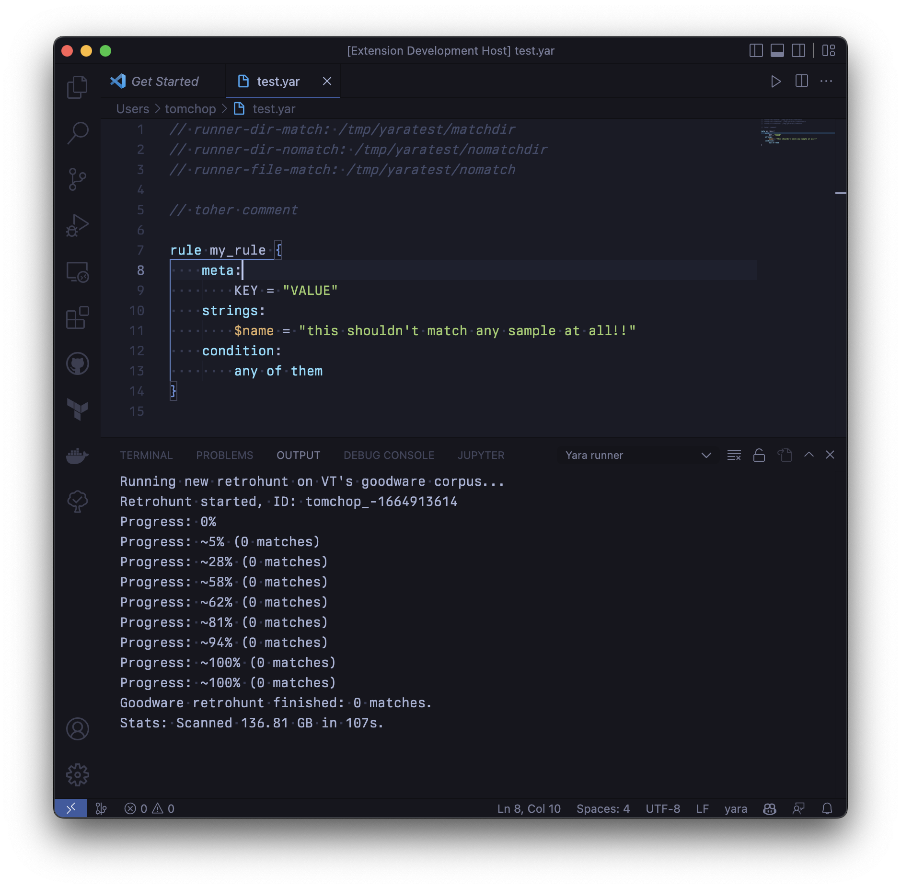

# yara-runner README

Run Yara goodware retrohunts and local files scans right from your VSCode IDE.



## Features

* Scanning the Virustotal goodware corpus (see [their blogpost](https://blog.virustotal.com/2019/10/test-your-yara-rules-against-goodware.html))
  * Open the command pallette and pick "Run a hunt on VT's goodware corpus."
  * Keyboard shortcut: `Shift + Ctrl + g`
  * Only one Goodware retrohunt will be run at a time (they take 1-2 minutes to complete).
  * Results will be streamed in the `Yara runner` output pane.

* Run your Yara rule on a set of local files straight from VSCode
  * Write some [directives](#writing-directives) to specify which files to run Yara on.
  * Open the command pallette and select "Run Yara rule on files."
  * Keyboard shortcut: `Shift + Ctrl + r`
  * Results will be reported in the `Yara runner` output pane.

## Requirements

* **Goodware hunt**: You'll need a VirusTotal API subscription and an API key to run your rule on VT's goodware corpus.

* **Local Yara scan**: You need to have a working Yara binary in your system for this extension to work.

## Writing directives

Directives are comments in your Yara rule file that describe what how yara-runner
should behave. It can run Yara on files or directories, in `match` or `nomatch`
modes. Think of it as just a wrapper around the binary, where `dir` will add the `-r` flag,
and `nomatch` will add the `-n` flag.

The directives take the form `runner-<TYPE>-<MATCH>`, where:

* `<TYPE>`: Whether the path is to a file (`file`) or a directory (`dir`). Directories will be treated recursively.
* `<MATCH>`: Whether the item at the path is expected to match (`match`) or not (`nomatch`).

Directives go at the top of your Yara rule file, in the form of comments, e.g.

```yara
// runner-dir-match: /analysis/malware1/samples
// runner-file-match: /analysis/malware1/sample1
// runner-dir-nomatch: /analysis/known-good/
// runner-file-nomatch: /analysis/known-good/kernel32.dll

rule my_rule {
    strings:
        $ = 'MZ'
    condition:
        any of them
}
```

## Extension Settings

This extension contributes the following settings:

* `yara-runner.yaraPath`: An optional full path to a Yara binary. Defaults to `yara` (so whatever that means in your path)
* `yara-runner.vtApiKey`: VirusTotal API key. Used for creating retrohunts in the 'goodware' corpus, which are free.

## Known Issues

Results are displayed in a non-deterministic order (Yara runs in parallel).

## Release Notes

See [CHANGELOG](CHANGELOG.md)

---
